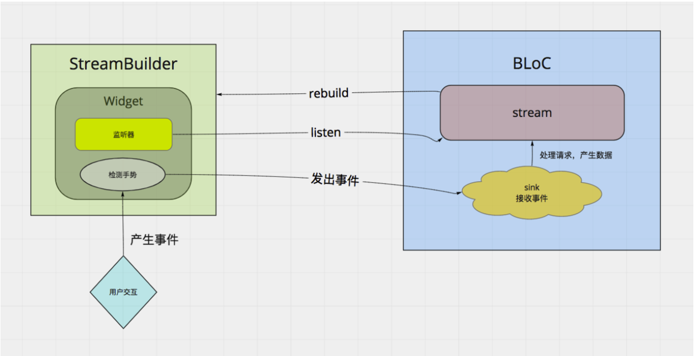

flutter的状态管理

参考
####[scroped_model](https://juejin.im/post/5b97fa0d5188255c5546dcf8)
Scoped model使用了观察者模式，将数据模型放在父代，后代通过找到父代的model进行数据渲染，最后数据改变时将数据传回，父代再通知所有用到了该model的子代去更新状态。

####[Redux](https://juejin.im/post/5ba26c086fb9a05ce57697da)
Redux是一种单向数据流架构，可以轻松开发，维护和测试应用程序。

#####我们在Redux中，所有的状态都储存在Store里。这个Store会放在App顶层。
#####View拿到Store储存的状态(State)并把它映射成视图。View还会与用户进行交互，用户点击按钮滑动屏幕等等，这时会因为交互需要数据发生改变。
#####Redux让我们不能让View直接操作数据，而是通过发起一个action来告诉Reducer，状态得改变啦。
#####这时候Reducer接收到了这个action，他就回去遍历action表，然后找到那个匹配的action，根据action生成新的状态并把新的状态放到Store中。
#####Store丢弃了老的状态对象，储存了新的状态对象后，就通知所有使用到了这个状态的View更新（类似setState）。这样我们就能够同步不同view中的状态了。

####[Stream](https://juejin.im/post/5baa4b90e51d450e6d00f12e)
####[BLoc](https://juejin.im/post/5bb6f344f265da0aa664d68a)
####[RxDart](https://juejin.im/post/5bcea438e51d4536c65d2232)
Stream非常有特点但却不太好理解，我与其按照字面意思把它看作流，更愿意把它看成一个工厂或者是机器。

#####它有一个入口，可以放东西/指令（anything）
#####这个机器不知道入口什么时候会放东西进来
#####中间的机器能够生产或者加工，这应该会耗费一些时间
#####他有一个出口，应该会有产品从那出来
#####我们也不知道到底什么时候产品会从出口出来
#####整个过程，时间都是一个不确定因素，我们随时都可以向这个机器的入口放东西进去，放进去了以后机器进行处理，但是我们并不知道它多久处理完。所以出口是需要专门派人盯着的，等待机器流出东西来。整个过程都是以异步的眼光来看的。

BLoC是一种利用reactive programming方式构建应用的方法，这是一个由流构成的完全异步的世界。

#####用StreamBuilder包裹有状态的部件，streambuilder将会监听一个流
#####这个流来自于BLoC
#####有状态小部件中的数据来自于监听的流。
#####用户交互手势被检测到，产生了事件。例如按了一下按钮。
#####调用bloc的功能来处理这个事件
#####在bloc中处理完毕后将会吧最新的数据add进流的sink中
#####StreamBuilder监听到新的数据，产生一个新的snapshot，并重新调用build方法
#####Widget被重新构建

[provider](https://juejin.im/post/5d00a84fe51d455a2f22023f)
Provider 从名字上就很容易理解，它就是用于提供数据，无论是在单个页面还是在整个 app 都有它自己的解决方案，我们可以很方便的管理状态。可以说，Provider 的目标就是完全替代 StatefulWidget。